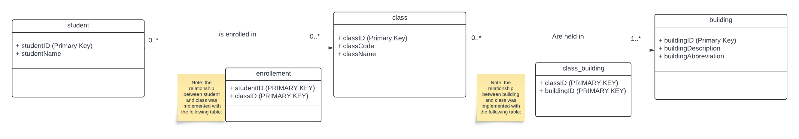

# Students
__________
My project model models a few students and their classes



### Query that I thought it did well on
__________
I was suprised that the model was able to successfully join all 5 tables together to get the correct answer of
```What are the names of students who have classes at the building with the abreviation JKB?```
```
SELECT s.student_name
FROM student s
JOIN enrollment e ON s.student_id = e.student_id
JOIN class c ON e.class_id = c.class_id
JOIN class_building cb ON c.class_id = cb.class_id
JOIN building b ON cb.building_id = b.building_id
WHERE b.building_abbreviation = 'JKB';
```
### Question that it tripped up on
__________
I tried the following query and I found that the model was unable to label MARB as an abbreviation and instead thought it was a description of the building.

```Can you tell me about the MARB building?```
returned the following:
```
SELECT b.building_id, b.building_description, b.building_abbreviation
FROM building b
WHERE b.building_description ILIKE '%MARB%';
```

I was able to fix this by doing the exact same query but specifying ```(MARB is an abbreviation)```

### Multi-shot
__________
I further improved the model by giving it more data. I fed it the same question that it struggled with as one of the example problems. Then I was able to ask about other buildings and get their descriptions returned based off giving the abbreviation. I thought that this was pretty cool!

### Conclusion
__________
I found that gpt-4o-mini worked quite well when it was given simple queries or if it had an abstract question with similar questions asked. This could work for non-engineers if they are traveling the "happy path" of queries, but otherwise I would be hesitant to trust the data that is being retrieved. 


### Other 6 Examples
[Examples](./examples.md)